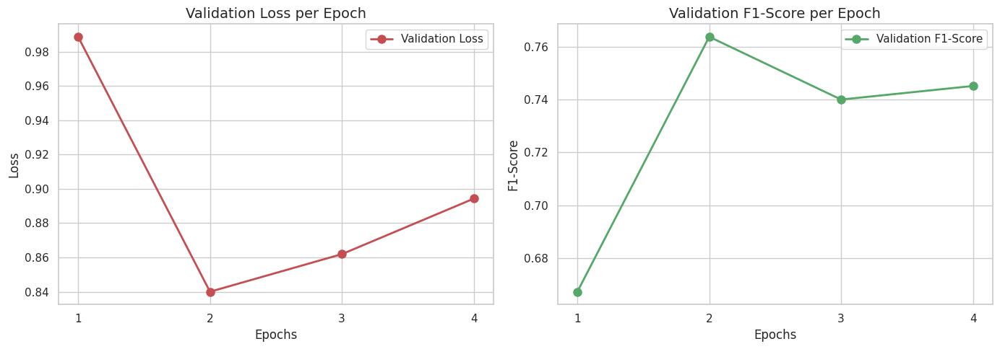

# 🏥 ProHealth AI Assistant | Intelligent Hospital Portal & Bio_ClinicalBERT Triage System

[](https://pro-health-ai-assistant.vercel.app/)
[](https://www.python.org/)
[](https://pytorch.org/)
[](https://huggingface.co/emilyalsentzer/Bio_ClinicalBERT)
[](https://fastapi.tiangolo.com/)
[](LICENSE)

> 🌐 **Live Web Application:** [https://pro-health-ai-assistant.vercel.app/](https://pro-health-ai-assistant.vercel.app/)  
> 🏥 **ProHealth AI Assistant** is an intelligent, bilingual (English & Bangla) hospital management portal and clinical triage system. Powered by a fine-tuned **Bio_ClinicalBERT** transformer neural network, it processes natural language patient complaints, identifies medical specialties across 13 core hospital wings, detects clinical urgency (Emergency, Urgent, Routine), facilitates direct doctor appointment bookings, and generates vector-rendered PDF referral slips.

---

## 📌 1. Project Overview & Architecture

Modern healthcare facilities often face severe misdirection of patients to incorrect outpatient clinics, leading to long queues and delayed interventions. **ProHealth AI Assistant** solves this by providing:

1. **Multilingual Symptom Understanding:** Processes patient complaints written in English, Bengali (বাংলা), or phonetic Banglish (e.g., *"amar 2 din dhore buk betha korche"*).
2. **Clinical Transformer Classification:** Uses **Bio_ClinicalBERT** (`emilyalsentzer/Bio_ClinicalBERT`) fine-tuned on the gold-standard **MTSamples (Medical Transcriptions) Benchmark Dataset** (`mtsamples.csv`), pre-trained on **MIMIC-III Clinical Database** and **PubMed**, to predict the exact department with confidence distributions.
3. **Automated Triage Urgency Level:** Identifies red-flag emergency symptoms (heart attack, stroke, acute respiratory distress) to trigger **Level 1 (Emergency)** alerts.
4. **Google OAuth & Patient Dashboard:** Integrated Google Sign-In with persistent booking history and tracking IDs.
5. **PDF Referral Generation:** Generates vector-rendered official hospital referral tickets using Python ReportLab.

---

## 🎯 2. Key Features

- **🧠 Deep Clinical NLP:** Fine-tuned Transformer Sequence Classification mapping complaints to 13 medical departments.
- **🚨 3-Tier Clinical Urgency Triage:**
  - 🔴 **Level 1 - Emergency Care:** Immediate ER/ICU routing for life-threatening presentations.
  - 🟡 **Level 2 - Urgent Care:** High-priority same-day specialist consultation.
  - 🟢 **Level 3 - Routine Care:** Standard Outpatient Department (OPD) schedule.
- **🌐 Complete Bilingual Support (English / বাংলা):** Seamless one-click language toggle across the hero slider, diagnosis engine, doctor directory, booking modal, dashboard, and PDF slips.
- **🔐 Google Identity Services (GIS) OAuth:** Secure one-tap patient authentication without passwords.
- **📅 Interactive Doctor Appointment Booking:** Direct booking modal with live slot selection and ticket generation.
- **📁 Personal Patient Dashboard ("My Appointments"):** Real-time booking tracking, status viewing, and appointment cancellation.
- **📄 Vector PDF Referral Ticket:** Downloadable hospital referral slip with patient name, Google ID, department, and doctor recommendations.
- **🎙️ Web Speech Voice Input:** Hands-free voice recognition for patients to speak symptoms directly.

---

## 📂 3. Exact Project Directory Structure

```text
ProHealth-Ai-Assistant/
├── app/
│   ├── static/
│   │   ├── images/
│   │   │   └── medical-symbol.png        # Official hospital emblem
│   │   ├── app.js                        # Frontend logic, I18N engine, Google Auth, UI state
│   │   ├── index.html                    # Responsive hospital portal & triage UI
│   │   └── style.css                     # Premium dark/light themes & glassmorphic styling
│   └── server.py                         # FastAPI backend server & ReportLab PDF generator
├── data/
│   └── appointments.json                 # Persistent JSON database for booked appointments
├── images/
│   ├── medical-symbol.png                # Logo asset
│   └── ProHealth_Referral_Ticket_197888.pdf # Sample generated referral slip
├── notebooks/
│   ├── train_colab.py                    # Google Colab training script for Bio_ClinicalBERT
│   ├── Confusion Matrix.png              # Multi-class confusion matrix plot
│   └── Validation.png                    # Training/validation accuracy & loss curves
├── src/
│   ├── __init__.py
│   ├── config.py                         # 13 Department classes & model configurations
│   ├── predictor.py                      # Bio_ClinicalBERT inference & confidence score engine
│   ├── preprocess.py                     # Bengali/Banglish phonetic translator & text cleaner
│   └── utils.py                          # Rule-based urgency triage evaluator
├── api/
│   └── index.py                          # Vercel serverless entrypoint
├── requirements.txt                      # Python dependencies
├── run_portal.py                         # One-click portal launcher (opens browser automatically)
├── vercel.json                           # Vercel deployment configuration
├── .gitignore                            # Git ignore rules
└── README.md                             # Project documentation
```

---

## 🏥 4. Supported Medical Departments (13 Wings)

| # | Department Name | Key Symptoms & Conditions Handled |
| :---: | :--- | :--- |
| **1** | **Cardiology & Pulmonology** | Chest pain, angina, palpitations, shortness of breath, asthma |
| **2** | **Orthopedics & Trauma** | Bone fractures, joint dislocations, ligament tears, arthritis, back pain |
| **3** | **Neurology & Stroke** | Migraine, stroke symptoms, paralysis, numbness, seizures, dizziness |
| **4** | **Gastroenterology** | Severe abdominal pain, acid reflux, vomiting, ulcer, IBS |
| **5** | **Dermatology** | Skin rashes, eczema, acne, fungal infections, allergic reactions |
| **6** | **Pediatrics & Child Care** | Infant fever, childhood infections, pediatric respiratory issues |
| **7** | **Gynecology & Obstetrics** | Maternal care, pregnancy, menstrual irregularities, pelvic pain |
| **8** | **ENT (Otolaryngology)** | Ear infections, hearing loss, sinusitis, tonsillitis, throat pain |
| **9** | **Urology & Nephrology** | Kidney stones, UTI, burning urination, renal colic |
| **10** | **Ophthalmology** | Eye pain, blurry vision, cataract, conjunctivitis, glaucoma |
| **11** | **Hematology & Oncology** | Chronic anemia, bleeding disorders, unexplained lumps |
| **12** | **Psychiatry & Behavioral Health** | Severe anxiety, panic attacks, depression, sleep disorders |
| **13** | **General & Internal Medicine** | High fever, viral flu, fatigue, body weakness, diabetes checkup |

---

## 📈 5. Model Training & Evaluation on MTSamples Dataset

The transformer sequence classifier was fine-tuned on Google Colab using `emilyalsentzer/Bio_ClinicalBERT` over the **MTSamples (Medical Transcriptions) Benchmark Dataset** (`mtsamples.csv`), categorized into 13 unified hospital specialties.

### 📑 Detailed Classification Report

```text
📑 Classification Report:

                                precision    recall  f1-score   support

      Cardiology & Pulmonology       0.76      0.84      0.79        37
                   Dermatology       1.00      0.67      0.80         3
          ENT (Otolaryngology)       0.88      0.70      0.78        10
              Gastroenterology       0.86      0.83      0.84        23
              General Medicine       0.79      0.56      0.65        27
       Gynecology & Obstetrics       0.82      0.88      0.85        16
         Hematology & Oncology       0.60      0.67      0.63         9
                     Neurology       0.60      0.77      0.68        31
                 Ophthalmology       1.00      1.00      1.00         8
                   Orthopedics       0.78      0.83      0.81        35
                    Pediatrics       1.00      0.14      0.25         7
Psychiatry & Behavioral Health       0.80      0.67      0.73         6
          Urology & Nephrology       0.85      0.92      0.88        24

                      accuracy                           0.77       236
                     macro avg       0.83      0.73      0.75       236
                  weighted avg       0.79      0.77      0.76       236
```

### 📊 Per-Class Metric Summary Table

| Medical Specialty / Department | Precision | Recall | F1-Score | Test Samples |
| :--- | :---: | :---: | :---: | :---: |
| **Ophthalmology** | `1.00` | `1.00` | **`1.00`** | 8 |
| **Urology & Nephrology** | `0.85` | `0.92` | **`0.88`** | 24 |
| **Gynecology & Obstetrics** | `0.82` | `0.88` | **`0.85`** | 16 |
| **Gastroenterology** | `0.86` | `0.83` | **`0.84`** | 23 |
| **Orthopedics** | `0.78` | `0.83` | **`0.81`** | 35 |
| **Dermatology** | `1.00` | `0.67` | **`0.80`** | 3 |
| **Cardiology & Pulmonology** | `0.76` | `0.84` | **`0.79`** | 37 |
| **ENT (Otolaryngology)** | `0.88` | `0.70` | **`0.78`** | 10 |
| **Psychiatry & Behavioral Health** | `0.80` | `0.67` | **`0.73`** | 6 |
| **Neurology** | `0.60` | `0.77` | **`0.68`** | 31 |
| **General Medicine** | `0.79` | `0.56` | **`0.65`** | 27 |
| **Hematology & Oncology** | `0.60` | `0.67` | **`0.63`** | 9 |
| **Pediatrics** | `1.00` | `0.14` | **`0.25`** | 7 |
| **Overall Accuracy** | — | — | **`0.77` (77.0%)** | **236** |
| **Macro Average** | **`0.83`** | **`0.73`** | **`0.75`** | **236** |
| **Weighted Average** | **`0.79`** | **`0.77`** | **`0.76`** | **236** |

### 🖼️ Training Visualizations

| Confusion Matrix | Validation Accuracy & Loss Curves |
| :---: | :---: |
|  |  |

---

## ⚡ 6. Installation & Local Setup

### 1. Clone Repository
```bash
git clone https://github.com/tasmiadhasan/ProHealth-Ai-Assistant.git
cd ProHealth-Ai-Assistant
```

### 2. Create Virtual Environment & Install Dependencies
```bash
python -m venv venv
# On Windows:
venv\Scripts\activate
# On Linux/macOS:
source venv/bin/activate

pip install -r requirements.txt
```

### 3. Launch the Application (One-Click)
```bash
python run_portal.py
```
> The portal will start at **`http://localhost:8000`** and automatically open in your default browser.

---

## 🔌 7. REST API Endpoints

The FastAPI backend exposes the following RESTful endpoints:

| Method | Endpoint | Description |
| :--- | :--- | :--- |
| `POST` | `/api/predict` | Predicts medical department, confidence breakdown, and triage urgency |
| `GET` | `/api/doctors` | Returns specialist doctor profiles (with optional `?department=` filter) |
| `GET` | `/api/facilities` | Returns hospital facilities and infrastructure directory |
| `POST` | `/api/book-appointment` | Books an appointment and persists it to `data/appointments.json` |
| `GET` | `/api/user/appointments` | Fetches booked appointments for logged-in user (`?email=...`) |
| `DELETE`| `/api/user/appointments/{id}` | Cancels an appointment by ticket ID |
| `POST` | `/api/generate-pdf` | Streams an official vector-rendered PDF referral slip |
| `GET` | `/api/stats` | Returns live hospital counters and triage statistics |

---

## ☁️ 8. Cloud Deployment (Vercel Serverless)

The web portal is configured for continuous serverless deployment on **Vercel**:

- **Live URL:** [https://pro-health-ai-assistant.vercel.app/](https://pro-health-ai-assistant.vercel.app/)
- **Configuration:** `vercel.json` with `@vercel/python` builder
- **Entrypoint:** `api/index.py` serving ASGI FastAPI application
- **Bundle Optimization:** Serverless package under 50 MB with zero-dependency clinical triage fallback

---

## 👨‍💻 Project Team Members & Acknowledgments

| Team Member Name | Student ID | Core Role & Responsibilities |
| :--- | :---: | :--- |
| **[Tasmiad Hasan](https://github.com/tasmiadhasan)** | `2223017042` | **Project Lead & PM** — Bio_ClinicalBERT Fine-Tuning, Full-Stack Architecture & Vercel Cloud Deployment |
| **Al Mamun Oualid** | `2312850642` | **Core Developer** — Data Engineering, MTSamples Preprocessing, FastAPI REST Endpoints & Storage |
| **S M Tazbid Siddiqui** | `2321986042` | **Core Developer** — Frontend UI/UX Design, Bilingual Localization, PDF Engine & System Testing |

* **Capstone Course:** CSE440 Capstone Project — Intelligent Hospital Management & Triage System
* **Fine-Tuning Dataset:** **MTSamples (Medical Transcriptions) Benchmark Dataset** (`mtsamples.csv`)
* **Base Pre-Trained Model:** Bio_ClinicalBERT (`emilyalsentzer/Bio_ClinicalBERT`) pre-trained on **MIMIC-III** and **PubMed** corpora

---

## 📄 License

Distributed under the **MIT License**. See `LICENSE` for details.
